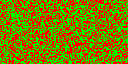
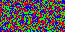
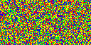
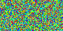
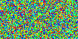
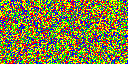
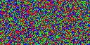
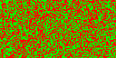

# Shard distribution

The initial distribution with a single node (in red) holds all shards on the same node:

A second node (in green) will get half of the shards from the first node:

The third node (in blue) will get half of its shards from each of the two original nodes:

A fourth node will get a third of its shards from the other three nodes:

Finally a fifth and sixth node will get an equal distribution of shards:

 

When reducing the number of nodes the existing nodes will get the shards from the node that left.

